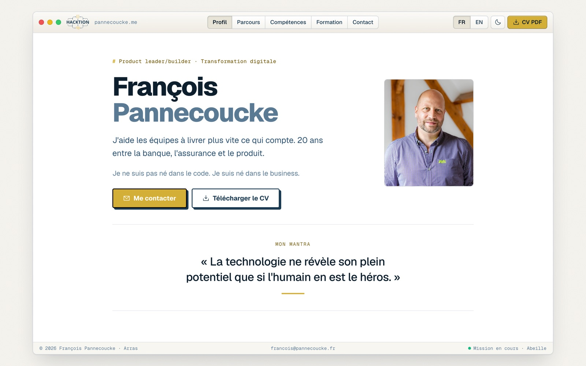

# CV interactif, François Pannecoucke

CV interactif open source, construit avec React, TypeScript et Tailwind CSS, pré-rendu en HTML statique et habillé du design system **Hacktion OS 2**.

**[▶ Voir le CV en ligne](https://pannecoucke.me)**

<p align="center">
  
</p>

---

## Inspiration et origine

Ce projet part du template open source **[interactive-resume-template](https://github.com/clementbouly/interactive-resume-template)** de [Clément Bouly](https://github.com/clementbouly), publié sous licence MIT.

Il a depuis été entièrement redessiné avec le langage **Hacktion OS 2**, déjà en production sur [hacktion.fr](https://hacktion.fr) : un bureau papier, une seule fenêtre à headerbar façon elementary OS (navigation en boutons liés, une action or), une colonne éditoriale en Geist, des eyebrows `#` en Geist Mono et des filets à la place des cartes.

---

## Fonctionnalités

- **Un seul fichier de contenu** : `src/data/resume-config.ts`, typé de bout en bout
- **Bilingue FR/EN** : une page par langue (`/` et `/en/`), bascule sans rechargement dans la headerbar, choix mémorisé, typographie française automatique (espaces insécables)
- **Mode clair/sombre** : bascule manuelle mémorisée, sans flash au chargement
- **Navigation par sections** : scroll-spy, URL à jour (`#parcours`), liens profonds
- **Accordéon** : une seule expérience ou mission ouverte à la fois, la mission en cours ouverte par défaut
- **Responsive** : navigation dans la headerbar sur grand écran, barre sticky défilante sur mobile
- **Téléchargement du CV en PDF** : un fichier par langue possible
- **Pré-rendu statique** : chaque page est générée en HTML complet au build, React s'y attache ensuite (contenu lisible sans JavaScript par les robots et les ATS)
- **Performance** : Lighthouse 100/100/100/100 en desktop, 99/100/100/100 en mobile ; polices hébergées sur le site, CSS inlinée, aucun script tiers
- **SEO** : JSON-LD `ProfilePage` + `Person`, `hreflang`, canonical par langue, `sitemap.xml`, Open Graph
- **Fichiers pour les IA** : `llms.txt`, `robots.txt` ouvert aux crawlers IA
- **Accessibilité** : navigation au clavier, focus visible, `aria-expanded` / `aria-current`, respect de `prefers-reduced-motion`

---

## Démarrage rapide

```bash
git clone https://github.com/francois-hacktion/pannecoucke-me.git
cd pannecoucke-me
npm install
npm run dev
```

Ouvrir [http://localhost:5173](http://localhost:5173).

Pour personnaliser le contenu, voir le [guide de personnalisation](docs/CUSTOMIZATION.md).

### Mettre à jour le PDF

Déposer le nouveau fichier dans `public/cv/`, puis mettre à jour `pdf.path` dans `src/data/resume-config.ts` si le nom change. Le PDF n'est téléchargé qu'au clic : il ne pèse rien sur le chargement de la page. Penser à renseigner ses métadonnées (titre, auteur) et à alléger les images embarquées.

---

## Déploiement

```bash
npm run build
```

Le build enchaîne le bundle client, le bundle serveur (`src/entry-server.tsx`) et le pré-rendu (`scripts/prerender.mjs`). Le dossier `dist/` contient le site statique, déployé sur **Cloudflare Pages** à chaque push sur `main`. Les en-têtes (cache, sécurité) sont dans `public/_headers`.

| Champ | Valeur |
|-------|--------|
| Build command | `npm run build` |
| Build output directory | `dist` |
| Variable `NODE_VERSION` | `20` |

---

## Stack technique

- [Vite](https://vite.dev/) : build
- [React 19](https://react.dev/) : interface
- [TypeScript](https://www.typescriptlang.org/) : typage statique
- [Tailwind CSS v4](https://tailwindcss.com/) : styles, tokens du design system en variables CSS, animations en CSS pur
- [Geist et Geist Mono](https://vercel.com/font) : typographie, hébergée dans `public/fonts` (licence OFL)
- Icônes [Phosphor](https://phosphoricons.com) (MIT), intégrées en SVG

---

## Structure du projet

```
├── src/
│   ├── data/
│   │   ├── resume-config.ts        # ← CONTENU DU CV
│   │   ├── resume-config.example.ts
│   │   └── types.ts
│   ├── components/
│   │   ├── os/                     # Fenêtre, headerbar, boutons liés, barre d'état
│   │   ├── ui/                     # Boutons, tags, eyebrows, accordéon
│   │   ├── Resume/                 # Sections du CV
│   │   └── icons/                  # Icônes Phosphor
│   ├── lib/                        # i18n, thème, navigation par sections, SEO
│   ├── entry-server.tsx            # Rendu serveur utilisé par le pré-rendu
│   └── globals.css                 # Tokens Hacktion OS 2 (clair/sombre), polices
├── public/
│   ├── cv/                         # CV PDF
│   ├── fonts/                      # Geist et Geist Mono (woff2, licence OFL)
│   ├── images/                     # Photo, logos Hacktion, image Open Graph
│   ├── _headers                    # En-têtes Cloudflare (cache, sécurité)
│   ├── llms.txt
│   ├── robots.txt
│   └── sitemap.xml
└── scripts/prerender.mjs           # Une page HTML complète par langue au build
```

---

## Licence

Projet distribué sous licence **MIT** : libre d'utilisation, de modification et de redistribution, avec mention de l'auteur original. Voir [LICENSE](./LICENSE).

---

*Contributions bienvenues via [Issues](https://github.com/francois-hacktion/pannecoucke-me/issues) ou Pull Requests.*
